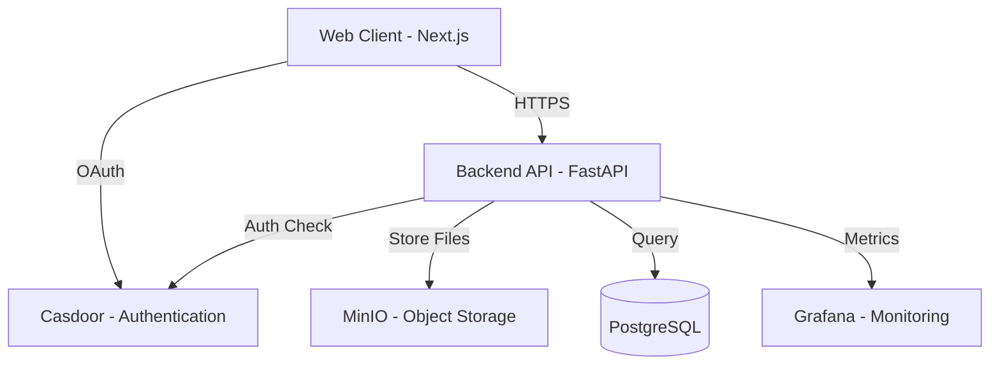

# Wataomi Documentation

## Tổng quan dự án

Wataomi là nền tảng quản lý và phân tích dữ liệu với kiến trúc monorepo, bao gồm:
- **Backend**: FastAPI (Python) - API services
- **Frontend**: Next.js (TypeScript) - Web application
- **Services**: Casdoor (Auth), MinIO (Storage), Grafana (Monitoring)

## Cấu trúc Monorepo

```
wataomi/
├── apps/
│   ├── backend/          # FastAPI application
│   └── web/              # Next.js application
├── services/             # Docker services (Casdoor, MinIO, Grafana)
├── docs/                 # Documentation hub
│   ├── README.md         # Tổng quan (file này)
│   ├── backend.md        # Backend documentation
│   ├── frontend.md       # Frontend documentation
│   ├── architecture.md   # System architecture
│   └── assets/           # Diagrams & images
└── .kiro/steering/       # Development standards
```

## Kiến trúc hệ thống



## Quick Start

### Prerequisites
- Node.js 18+
- Python 3.11+
- Docker & Docker Compose

### Development Setup

1. **Clone repository**
```bash
git clone <repository-url>
cd wataomi
```

2. **Install dependencies**
```bash
npm install
cd apps/backend && pip install -r requirements.txt
```

3. **Start services**
```bash
docker-compose up -d
```

4. **Initialize database**
```bash
# Initialize and migrate database
npm run db:init
npm run db:migrate "Initial migration"
npm run db:upgrade

# Sync users from Casdoor (optional)
npm run db:sync
```

5. **Run applications**
```bash
# Terminal 1 - Backend
cd apps/backend
python run.py

# Terminal 2 - Frontend
cd apps/web
npm run dev
```

## Tài liệu chi tiết

- [Backend Documentation](./backend.md) - API endpoints, database schema, services
- [Frontend Documentation](./frontend.md) - Components, routing, state management
- [Architecture Documentation](./architecture.md) - System design, deployment, security
- [Database Migrations](./database-migrations.md) - Migration guide, Alembic usage
- [Casdoor Integration](./casdoor-integration.md) - Authentication, user sync

## Design System

Wataomi sử dụng design system dựa trên Indigo palette với accessibility standards.

### Brand Colors
- **Primary**: Indigo (#6366f1)
- **Secondary**: Slate (#64748b)
- **Accent**: Emerald (#10b981)
- **Error**: Red (#ef4444)
- **Warning**: Amber (#f59e0b)
- **Success**: Green (#22c55e)

Chi tiết: [Frontend Documentation - Design System](./frontend.md#design-system)

## Coding Standards

Dự án tuân theo coding standards nghiêm ngặt để đảm bảo code quality và consistency.

### Commit Convention
```
type(scope): subject

feat(backend): add user authentication endpoint
fix(web): resolve navigation bug on mobile
docs(readme): update setup instructions
```

### Code Review Checklist
- [ ] Code follows style guide (ESLint/Black)
- [ ] Tests pass and coverage maintained
- [ ] Documentation updated
- [ ] No security vulnerabilities
- [ ] Accessibility standards met

Chi tiết: `.kiro/steering/coding-standards.md`

## Contributing

1. Tạo branch từ `main`: `git checkout -b feature/your-feature`
2. Commit theo convention: `git commit -m "feat: your feature"`
3. Push và tạo Pull Request
4. Đợi code review và approval

## Resources

- [Backend API Reference](./backend.md#api-reference)
- [Frontend Component Library](./frontend.md#components)
- [Deployment Guide](./architecture.md#deployment)
- [Troubleshooting](./architecture.md#troubleshooting)

## Support

- **Issues**: GitHub Issues
- **Discussions**: GitHub Discussions
- **Email**: support@wataomi.com
