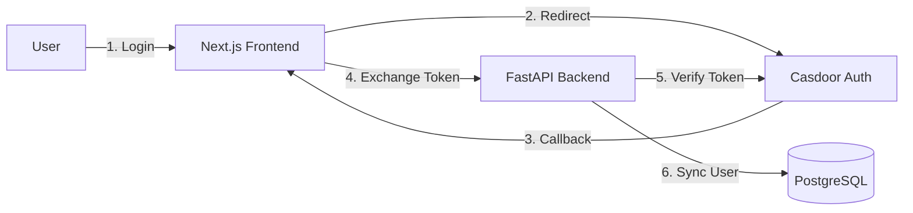

# Casdoor Integration Guide

## Tổng quan

Wataomi sử dụng **Casdoor** làm authentication và user management service. Casdoor cung cấp OAuth2/OIDC authentication với nhiều tính năng như SSO, MFA, và user federation.

## Kiến trúc



## Setup Casdoor

### 1. Cài đặt Casdoor

#### Docker Compose (Recommended)

```yaml
# services/casdoor/docker-compose.yml
version: '3.8'

services:
  casdoor:
    image: casbin/casdoor:latest
    ports:
      - "8030:8000"
    environment:
      - RUNNING_IN_DOCKER=true
    volumes:
      - ./conf:/conf
      - ./data:/data
    restart: unless-stopped
```

```bash
cd services/casdoor
docker-compose up -d
```

#### Manual Installation

```bash
# Download Casdoor
wget https://github.com/casdoor/casdoor/releases/latest/download/casdoor-linux-amd64

# Make executable
chmod +x casdoor-linux-amd64

# Run
./casdoor-linux-amd64
```

### 2. Cấu hình Casdoor

Truy cập: http://localhost:8030

**Default credentials**:
- Username: `admin`
- Password: `123`

### 3. Tạo Organization

1. Navigate to **Organizations**
2. Click **Add**
3. Fill in:
   - Name: `wataomi`
   - Display Name: `Wataomi`
   - Website: `http://localhost:3000`

### 4. Tạo Application

1. Navigate to **Applications**
2. Click **Add**
3. Fill in:
   - Name: `wataomi-app`
   - Display Name: `Wataomi Application`
   - Organization: `wataomi`
   - Redirect URLs:
     - `http://localhost:3000/api/auth/callback/casdoor`
     - `http://localhost:8000/api/v1/casdoor/auth/callback`
   - Grant Types: `authorization_code`, `refresh_token`
   - Token Format: `JWT`

4. Copy **Client ID** và **Client Secret**

### 5. Lấy Certificate

1. Navigate to **Certs**
2. Select certificate (usually `cert-built-in`)
3. Copy certificate content

## Backend Configuration

### 1. Environment Variables

Thêm vào `apps/backend/.env`:

```bash
# Casdoor OAuth
CASDOOR_ENDPOINT=http://localhost:8030
CASDOOR_CLIENT_ID=your_client_id_from_step_4
CASDOOR_CLIENT_SECRET=your_client_secret_from_step_4
CASDOOR_APP_NAME=wataomi-app
CASDOOR_ORG_NAME=wataomi
CASDOOR_CERTIFICATE=-----BEGIN CERTIFICATE-----
MIIBIjANBgkqhkiG9w0BAQEFAAOCAQ8AMIIBCgKCAQEA...
-----END CERTIFICATE-----
```

### 2. Sync Users từ Casdoor

```bash
cd apps/backend

# Sync users và applications
python -m app.scripts.migrate sync
```

**Script sẽ**:
- Fetch users từ Casdoor API
- Tạo/update users trong local database
- Sync user profiles (email, name, avatar)
- Tạo workspaces từ applications
- Assign users to default workspace

### 3. Verify Sync

```bash
# Check database
psql -U wataomi -d wataomi

# Query users
SELECT id, email, full_name, casdoor_id FROM users;

# Query workspaces
SELECT id, name, display_name FROM workspaces;

# Query workspace members
SELECT w.name, u.email, wm.role 
FROM workspace_members wm
JOIN workspaces w ON wm.workspace_id = w.id
JOIN users u ON wm.user_id = u.id;
```

## Frontend Configuration

### 1. Environment Variables

Thêm vào `apps/web/.env.local`:

```bash
# Casdoor
CASDOOR_ENDPOINT=http://localhost:8030
CASDOOR_CLIENT_ID=your_client_id
CASDOOR_CLIENT_SECRET=your_client_secret
CASDOOR_ORG_NAME=wataomi
CASDOOR_APP_NAME=wataomi-app

# NextAuth
NEXTAUTH_URL=http://localhost:3000
NEXTAUTH_SECRET=your-nextauth-secret
```

### 2. NextAuth Configuration

```typescript
// apps/web/auth.ts
import NextAuth from "next-auth";
import CasdoorProvider from "next-auth/providers/casdoor";

export const { handlers, auth, signIn, signOut } = NextAuth({
  providers: [
    CasdoorProvider({
      clientId: process.env.CASDOOR_CLIENT_ID!,
      clientSecret: process.env.CASDOOR_CLIENT_SECRET!,
      issuer: `${process.env.CASDOOR_ENDPOINT}`,
    }),
  ],
  callbacks: {
    async jwt({ token, account, profile }) {
      if (account) {
        token.accessToken = account.access_token;
        token.casdoorId = profile?.sub;
      }
      return token;
    },
    async session({ session, token }) {
      session.accessToken = token.accessToken;
      session.user.casdoorId = token.casdoorId;
      return session;
    },
  },
});
```

## API Endpoints

### Backend Endpoints

#### 1. Casdoor Callback

```http
GET /api/v1/casdoor/auth/callback?code=xxx&state=xxx
```

**Response**:
```json
{
  "access_token": "eyJhbGciOiJSUzI1NiIs...",
  "token_type": "Bearer",
  "expires_in": 3600,
  "refresh_token": "eyJhbGciOiJSUzI1NiIs..."
}
```

#### 2. Get Current User

```http
GET /api/v1/auth/me
Authorization: Bearer {access_token}
```

**Response**:
```json
{
  "id": "uuid",
  "email": "user@example.com",
  "full_name": "John Doe",
  "avatar_url": "https://...",
  "casdoor_id": "admin",
  "is_active": true,
  "workspaces": [
    {
      "id": 1,
      "name": "default",
      "role": "member"
    }
  ]
}
```

#### 3. Refresh Token

```http
POST /api/v1/auth/refresh
Content-Type: application/json

{
  "refresh_token": "eyJhbGciOiJSUzI1NiIs..."
}
```

### Frontend Endpoints

#### 1. Sign In

```typescript
import { signIn } from "next-auth/react";

// Redirect to Casdoor login
await signIn("casdoor", { callbackUrl: "/dashboard" });
```

#### 2. Sign Out

```typescript
import { signOut } from "next-auth/react";

await signOut({ callbackUrl: "/" });
```

#### 3. Get Session

```typescript
import { useSession } from "next-auth/react";

function Component() {
  const { data: session, status } = useSession();
  
  if (status === "loading") return <div>Loading...</div>;
  if (status === "unauthenticated") return <div>Not logged in</div>;
  
  return <div>Welcome {session.user.name}</div>;
}
```

## User Sync Script

### Script Location

```
apps/backend/app/scripts/sync_casdoor.py
```

### Functions

#### 1. `sync_users_from_casdoor()`

Sync users từ Casdoor:

```python
async def sync_users_from_casdoor():
    """Sync users from Casdoor to local database."""
    sdk = get_casdoor_sdk()
    users_response = sdk.get_users()
    
    for casdoor_user in users_response["data"]:
        # Create or update user in database
        ...
```

#### 2. `sync_applications_from_casdoor()`

Sync applications và tạo workspaces:

```python
async def sync_applications_from_casdoor():
    """Sync applications from Casdoor (workspace mapping)."""
    sdk = get_casdoor_sdk()
    apps_response = sdk.get_applications()
    
    for casdoor_app in apps_response["data"]:
        # Create workspace for application
        ...
```

#### 3. `ensure_default_workspace()`

Đảm bảo default workspace tồn tại:

```python
async def ensure_default_workspace():
    """Ensure a default workspace exists."""
    # Create default workspace if not exists
    ...
```

#### 4. `assign_users_to_default_workspace()`

Assign users chưa có workspace:

```python
async def assign_users_to_default_workspace():
    """Assign all users without workspace to default workspace."""
    # Assign users to default workspace
    ...
```

### Run Sync

```bash
# From root
npm run db:sync

# From backend
cd apps/backend
python -m app.scripts.migrate sync

# Or directly
python -m app.scripts.sync_casdoor
```

### Sync Output

```
🔄 Starting Casdoor sync...
📍 Casdoor Endpoint: http://localhost:8030
📍 Organization: wataomi
📍 Application: wataomi-app

👥 Syncing users from Casdoor...
📥 Found 5 users in Casdoor
✅ Synced 3 new users, updated 2 users

📱 Syncing applications from Casdoor...
📥 Found 2 applications in Casdoor
✅ Synced 1 new workspaces from applications

🏢 Ensuring default workspace...
✅ Default workspace already exists

👤 Assigning users to default workspace...
✅ Assigned 3 users to default workspace

✅ Casdoor sync completed successfully!
```

## Automatic Sync

### On Application Startup

Backend tự động sync users khi khởi động:

```python
# apps/backend/app/main.py

@app.on_event("startup")
async def on_startup():
    await init_db()
    
    # Auto-sync users on startup
    try:
        from app.services.simple_sync import sync_database_users
        await sync_database_users()
    except Exception as e:
        print(f"⚠️  User sync failed: {e}")
```

### Scheduled Sync (Optional)

Sử dụng cron job hoặc scheduler:

```bash
# Crontab example - sync every hour
0 * * * * cd /path/to/wataomi/apps/backend && python -m app.scripts.sync_casdoor
```

## User Model

```python
# apps/backend/app/models/user.py

class User(SQLModel, table=True):
    __tablename__ = "users"
    
    id: Optional[int] = Field(default=None, primary_key=True)
    casdoor_id: str = Field(unique=True, index=True)  # Casdoor user ID
    email: str = Field(unique=True, index=True)
    full_name: Optional[str] = None
    avatar_url: Optional[str] = None
    is_active: bool = Field(default=True)
    created_at: datetime = Field(default_factory=datetime.utcnow)
    updated_at: datetime = Field(default_factory=datetime.utcnow)
```

## Troubleshooting

### Casdoor Connection Failed

```bash
# Check Casdoor is running
curl http://localhost:8030/.well-known/openid-configuration

# Check environment variables
cat apps/backend/.env | grep CASDOOR

# Test connection
python -c "
from app.core.config import settings
print(f'Endpoint: {settings.CASDOOR_ENDPOINT}')
print(f'Client ID: {settings.CASDOOR_CLIENT_ID}')
"
```

### No Users Synced

```bash
# Check Casdoor has users
# Login to Casdoor UI: http://localhost:8030
# Navigate to Users section

# Check API response
python -c "
from casdoor import CasdoorSDK
from app.core.config import settings

sdk = CasdoorSDK(
    endpoint=settings.CASDOOR_ENDPOINT,
    client_id=settings.CASDOOR_CLIENT_ID,
    client_secret=settings.CASDOOR_CLIENT_SECRET,
    certificate=settings.CASDOOR_CERTIFICATE,
    org_name=settings.CASDOOR_ORG_NAME,
    application_name=settings.CASDOOR_APP_NAME,
)

users = sdk.get_users()
print(users)
"
```

### Certificate Issues

```bash
# Verify certificate format
cat apps/backend/.env | grep -A 10 CASDOOR_CERTIFICATE

# Certificate should be:
CASDOOR_CERTIFICATE=-----BEGIN CERTIFICATE-----
MIIBIjANBgkqhkiG9w0BAQEFAAOCAQ8AMIIBCgKCAQEA...
-----END CERTIFICATE-----

# No extra spaces or line breaks
```

### Database Sync Issues

```bash
# Check database connection
psql -U wataomi -d wataomi -c "SELECT 1"

# Check users table
psql -U wataomi -d wataomi -c "SELECT * FROM users"

# Reset and retry
python -m app.scripts.migrate reset
```

## Best Practices

### 1. Regular Sync

Sync users định kỳ để đảm bảo consistency:

```bash
# Daily sync via cron
0 0 * * * cd /path/to/wataomi/apps/backend && python -m app.scripts.sync_casdoor
```

### 2. Error Handling

Script có built-in error handling:

```python
try:
    await sync_users_from_casdoor()
except Exception as e:
    print(f"❌ Error syncing users: {e}")
    # Continue with other operations
```

### 3. Backup Before Sync

```bash
# Backup database before major sync
pg_dump -U wataomi -d wataomi > backup_$(date +%Y%m%d).sql

# Run sync
python -m app.scripts.migrate sync
```

### 4. Monitor Sync Logs

```bash
# Run with output logging
python -m app.scripts.sync_casdoor 2>&1 | tee sync_$(date +%Y%m%d_%H%M%S).log
```

## Resources

- [Casdoor Documentation](https://casdoor.org/docs/overview)
- [Casdoor Python SDK](https://github.com/casdoor/casdoor-python-sdk)
- [NextAuth.js Documentation](https://next-auth.js.org/)
- [OAuth 2.0 Specification](https://oauth.net/2/)
